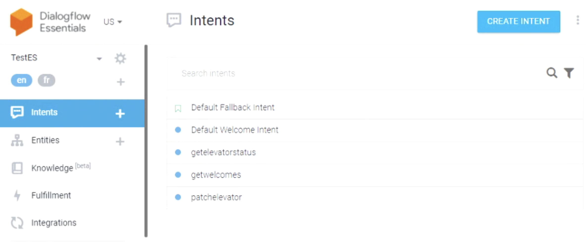
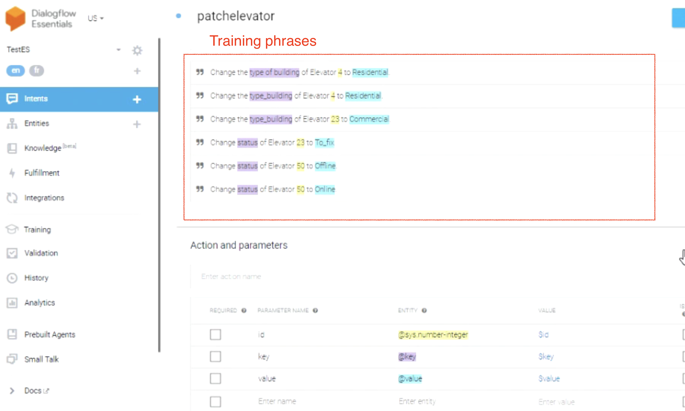
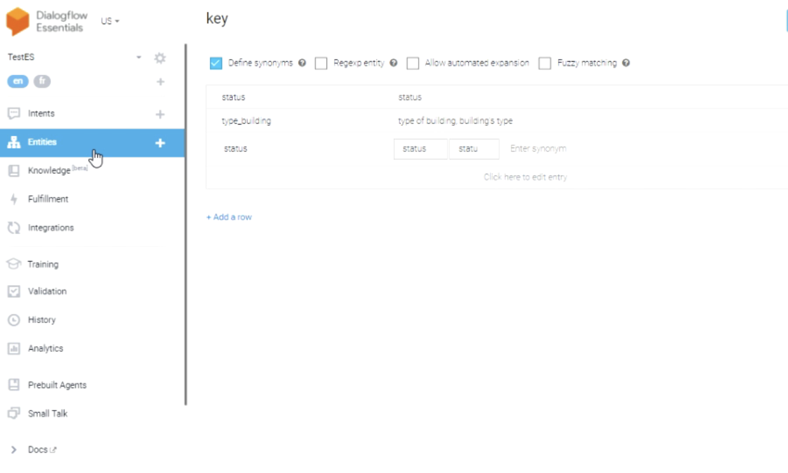
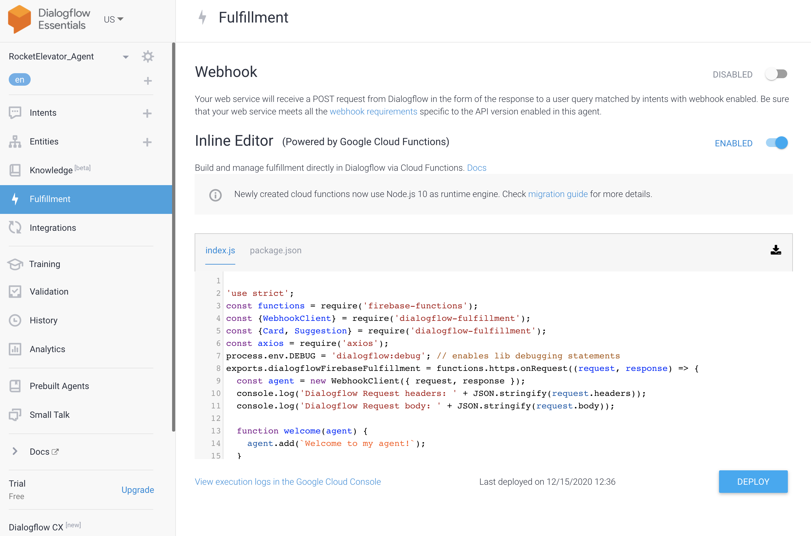

# RocketElevators-AI Chatbot in slack

## Summary
- [RestAPI Modification](#restapi-modification)
- [DialogFlow of GoogleCloud](#dialogflow-of-googlecloud)
    - [Creating intents](#1---creating-intents)
    - [Creating Entities](#2---creating-entities)
    - [Custom with fulfillment](#3---custom-outputs-using-fulfillment)
- [Samples in slack](#samples-in-slack)
- [Developers](#developers)

## RestAPI Modification
### New Controller
##### file : https://github.com/tonTed/RE_Cons_RESTApi/blob/master/Controllers/WelcomesController.cs
Creating new controller with the endpoint 'welcomes' returning the string:
```c++
public class WelcomesController : ControllerBase
    {
        private readonly InformationContext _context;
        public WelcomesController(InformationContext context)
        {
            _context = context;
        }

        [Route("api/Welcomes")]
        [HttpGet]
        public string GetWelcomes(){
            
            //creating variables with the amounts of each elements
            int elevators_amount = _context.elevators.ToList().Count();
            int batteries_amount = _context.batteries.ToList().Count();
            int quotes_amount = _context.quotes.ToList().Count();
            int leads_amount = _context.leads.ToList().Count();
            int customers_amount = _context.customers.ToList().Count();

            var list_elevtors_not_online =    from elevator in _context.elevators
                                        where elevator.status.ToLower() != "online"
                                        select elevator;

            int elevtors_not_online_amount = list_elevtors_not_online.Count();
            
            IEnumerable<Address> addresses_building = from address in _context.addresses where address.type_address == "Building" select address;
            
            int buildings_count = addresses_building.Select(x => x.address).Distinct().Count();

            int cities_distinct_count = addresses_building.Select(x => x.city).Distinct().Count();

            // Formating string to return
            string response = "Greetings!\n\There are currently " + elevators_amount + " elevators deployed in the " + buildings_count + " buildings of your " + customers_amount + " customers.\nCurrently, " + elevtors_not_online_amount + " elevators are not in Running Status and are being serviced.\n" + batteries_amount + " Batteries are deployed across " + cities_distinct_count + " cities.\nOn another note you currently have " + quotes_amount + " quotes awaiting processing.\nYou also have " + leads_amount + " leads in your contact requests.";
            
            return response;
        }
    }
```
 
 ## DialogFlow of GoogleCloud
 Dialogflow is a natural language understanding platform that makes it easy to design and integrate a conversational user interface into your mobile app, web application, device, bot, interactive voice response system, and so on. Using Dialogflow, you can provide new and engaging ways for users to interact with your product.
 
 Dialogflow can analyze multiple types of input from your customers, including text or audio inputs (like from a phone or voice recording). It can also respond to your customers in a couple of ways, either through text or with synthetic speech.
 
 ### Steps
 #### 1 - Creating intents
 - getWelcomes
 - getElevatorStatus
 - patchElevator
 
 &nbsp;

 
 
 &nbsp;
 &nbsp;
 
 ##### Patch Elevator:
 First we create variables in "action  and parameters"
 After we create diferents training phrases and link each parameters with is entity
 
  
  
  &nbsp;
  &nbsp;
 #### 2 - Creating Entities
 ##### Entity Key:
 Creating the entity @key, we give it some synonym words for incrase the match with the input of the user.
 
 
  &nbsp;
  &nbsp;
  
  #### 3 - Custom outputs using fulfillment
  ##### file : index.js
  
  We can increase the operation system with creating function in the index.js and deploy it
 
 
 
 #### Function getElevatorStatus:
 ```javascript
  function getelevatorstatus(agent){
    const id = agent.parameters.integerperso;
    console.log('##### Inside getelevatorstatus #####');
    // Calling the RestAPI and returning the status of the elevator called
    return axios.get(`https://tontedrocketelevatorrestapi.azurewebsites.net/api/elevators/${id}`)
    .then((result) => {
      	console.log(result.data);
        agent.add(result.data.status);
    });
```

#### Mapping with the getelevatorstatus entity:
```javascript
let intentMap = new Map();

intentMap.set('getelevatorstatus', getelevatorstatus);

agent.handleRequest(intentMap);

```

## Invitation for slack:
https://join.slack.com/t/team1-ctf2553/shared_invite/zt-ke0mg6fk-G4QuU3fUBrGmWkpc3BOIxw

## Samples in slack:

 
 


## Developers:
- [William](https://github.com/WillJacques)
- [Kiefer](https://github.com/KieferRiv)
- [Julien](https://github.com/Jdup29)
- [Louis-David](https://github.com/kngBMermaid)
- [Saad](https://github.com/saadeddinne)
- [Teddy Blanco](https://github.com/tonTed)
 
 
 
