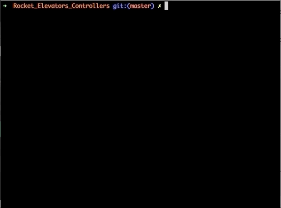

# Rocket_Elevators_Controllers

Contains the algorithm files for the elevator controllers for the New Rocket Elevator Solutions.

 
    ├── Rocket_Elevators_Controllers          
        ├── Commercial_Controllers
        ├── Residential_Controllers
        ├── assets 
        ├── .gitignore   
        └── README.md               
 

## Residential Controllers (Python, Ruby and Javascript)

    ├── ...
    ├── Residential_Controllers
    │    ├── Residential_Controller.algo
    │    ├── Residential_Controller.py
    │    ├── Residential_Controller.rb
    │    └── Commercial_Controller.js
    ├── ...


- For test the algorithm with the three scenario given, go on TESTING SECTION and launch the function `letsGo` :

#### Python:
```python
############################ TESTING SECTION ###########################
letsGo()
```

#### Ruby:

```ruby
############################ TESTING SECTION ###########################
letsGo
```

#### Javascript:
```javascript
############################ TESTING SECTION ###########################
letsGo();
```
&nbsp;

- For set a new scenario go on SCENARIO SECTION, and do it in the function `letsGo()`

### Create a Scenario:

#### create column : `[name] = Column([floors], [quantity of elevators])` 
*Exemple:* 

#### Python:
```python
column = Column(10, 2)
```

#### Ruby:

```ruby
column = Column.new(10, 2)
```

#### Javascript:
```javascript
column = new Column(10, 2);
```
&nbsp;

#### Elevators are automatically created and is name are "elevator[i]". i start a 0 and increase to 1 for how much elevators are created. For call then 
*Exemple:*

#### Python, Ruby and Javascript:
```python
column.listElevators["elevator0"]
```
&nbsp;


#### Two attributs of them can be changed `currentFloor` and `status`

The status can be `"up"`, `"down"` or by default `"idle"`.

The currentFloor is an `int` from 1 to floors given during the creation of column.


*Exemple:*
#### Python, Ruby and Javascript:
```python 
column.listElevators["elevator0"].currentFloor = 4
column.listElevators["elevator1"].status = "down"
```
&nbsp;

#### We can use two function for execute the scripts `requestElevator` and `requestedFloor`
`requestElevator` needs two parameters, the floor where the request has been made ( `int` between 1 and the floors) and returns the best elevator. 

Give it in a variable for use after for call de second function `requestedFloor` it needs the floor requested for the user (`int` between 1 and the floors)

*Exemple:*
#### Python, Ruby and Javascript:
```python 
elevator = column.requestElevator(3, "up")

elevator.requestedFloor(7)
```

#### Output of this exemple:


## Ruby UI Terminal
Run a game and play it with!!! Enjoy 😉  
```ruby
newGame = Game.new
```


## Commercial Controllers (C#, Go, Java)

    ├── ...
    ├── Commercial_Controllers
    │   ├── C#
    │   │    ├── Program.cs
    │   │    └── Commercial_Controller.csproj
    │   ├── GO
    │   │    └── main.go
    │   ├── Java
    │   │    └── Commercial_Controller.java 
    │   ├── Elixir
    │   │    └── Commercial_Controllers.exs
    │   └── Commercial_Controller.algo
    ├── ...

- For test the algorithm with the three scenario given, go on main functions.

#### C#:
```js
    static void Main(string[] args)
    {
        Scenario scenario = new Scenario();
        Console.WriteLine("<><><><><> Scenario 1 <><><><><>");
        scenario.scenario1();
        Console.WriteLine("\n<><><><><> Scenario 2 <><><><><>");
        scenario.scenario2();
        Console.WriteLine("\n<><><><><> Scenario 3 <><><><><>");
        scenario.scenario3();
        Console.WriteLine("\n<><><><><> Scenario 4 <><><><><>");
        scenario.scenario4();
    }
```

#### Go:

```js
func main() {
	Sceniario1()
	Sceniario2()
	Sceniario3()
	Sceniario4()
}
```

#### Java:
```js
    public static void main(String[] args) {
        scenario();
    }
```
&nbsp;

- For set a new scenario go on functions scenario and create a new function like the other scenario

### Create a Scenario:

#### create batterie : 
*Exemple:* 

#### C#:
```js
Batterie batterie1 = new Batterie(66, 6, columns, 5);
```

#### Go:

```js
batterie___1 := NewBatterie(66, 6, columns, 5)
```

#### Java:
```js
Batterie batterie1 = new Batterie(66, 6, columns, 5);
```
&nbsp;

#### Columns are automatically created and is name are "column[L]". L start a A and increase to B, etc... for how much elevators are created. For call then 
*Exemple:*

#### C#, Go:
```js
batterie1.listColumns['B']
```

#### Java:
```js
batterie1.listColumns.get("A")
```
&nbsp;

#### Elevators are automatically created and is name are "elevator[Li]". 
L is the ID of the column and i start a 0 and increase to 1 for how much elevators are created in each column. For call then 
*Exemple:*

#### C#, Go:
```js
batterie1.listColumns['B']
```

#### Java:
```js
batterie1.listColumns.get("A")
```
&nbsp;

#### Two attributs of them can be changed `currentFloor` and `status`

The status can be `"up"`, `"down"` or by default `"idle"`.

The currentFloor is an `int` from 1 to floors given during the creation of column.


*Exemple:*
#### C#, Go:
```js
batterie1.listColumns['B'].listElevators["B4"].currentFloor = 15;
batterie1.listColumns['B'].listElevators["B4"].status = "up";
```

#### Java:
```js
batterie1.listColumns.get("B").listElevators.get("B4").currentFloor = 15;
batterie1.listColumns.get("B").listElevators.get("B4").status = "up"
```
&nbsp;

#### We can use two function for execute the scripts `requestElevator` and `assignElevator`
`requestElevator` needs one parameter, the floor where the request has been made ( `int`) and take the best elevator.&nbsp;

`assignElevator` needs one parameter, the floor where the user can go ( `int`) and choice the column what's serve this floor et take the best elevator. 

*Exemple:*
#### C#, Go:
```js
batterie1.listColumns['B'].requestElevator(13);
batterie1.assignElevator(5);

```

#### Java:
```js
batterie1.listColumns.get("B").requestElevator(13);
batterie1.assignElevator(5);
```

## Loading..... (Elixir)

#### For the moment we can only create a Batterie full, and use the function moveElevator between two floors.

```js
defmodule Main do
  def main do
    
    # Parameters Floors, Basements, columns, elevators per columns
    batterie = Setup.batterie(66, 6, 4, 5)
    IO.inspect(batterie)
    
    # move elevator between 2 floors
    Elevator.moveElevator(10,5)
    Elevator.moveElevator(2,16)
    Elevator.moveElevator(10,10)
  end
end
```
#### Function moveElevator (recursive function):

```js
  def moveElevator(requestedFloor, currentFloor) do
      if requestedFloor > currentFloor do
        moveUp(requestedFloor, currentFloor)
      else
        moveDown(requestedFloor, currentFloor)
      end
    end
    defp moveUp(requestedFloor, currentFloor) do
      if requestedFloor == currentFloor do
        IO.puts "\t\t Your are comming on floor #{currentFloor}"
        openDoor()
      else
        IO.puts "\t\t Moving from #{currentFloor} to #{currentFloor + 1}"
        Tools.sleep()
        moveUp(requestedFloor, currentFloor + 1)
      end
  end

  defp moveDown(requestedFloor, currentFloor) do
    if requestedFloor == currentFloor do
      IO.puts "\t\t Your are comming on floor #{currentFloor}"
      Elevator.openDoor()
    else
      IO.puts "\t\t Moving from #{currentFloor} to #{currentFloor - 1}"
      Tools.sleep()
      moveDown(requestedFloor, currentFloor - 1)
    end
  end
```

#### Constructors of elements (Batterie, Columns, Elevator):
```js
  def batterie(floors, basements, q_columns, q_elevators) do
    %Batterie{floors: floors, basements: basements, l_columns: Batterie.c_columns(q_columns, q_elevators)}
  end

  def c_columns(qty_c, qty_e) do
    for i <- 1..qty_c, into: %{}, do: {"C#{i}", %Column{id: "C#{i}", l_elevators: Column.create_elevators("C#{i}", qty_e)}}
  end

  def create_elevators(id, q) do
    for i <- 1..q, into: %{}, do: {{"#{id}#{i}"}, %Elevator{id: "#{id}#{i}"}}
  end

```